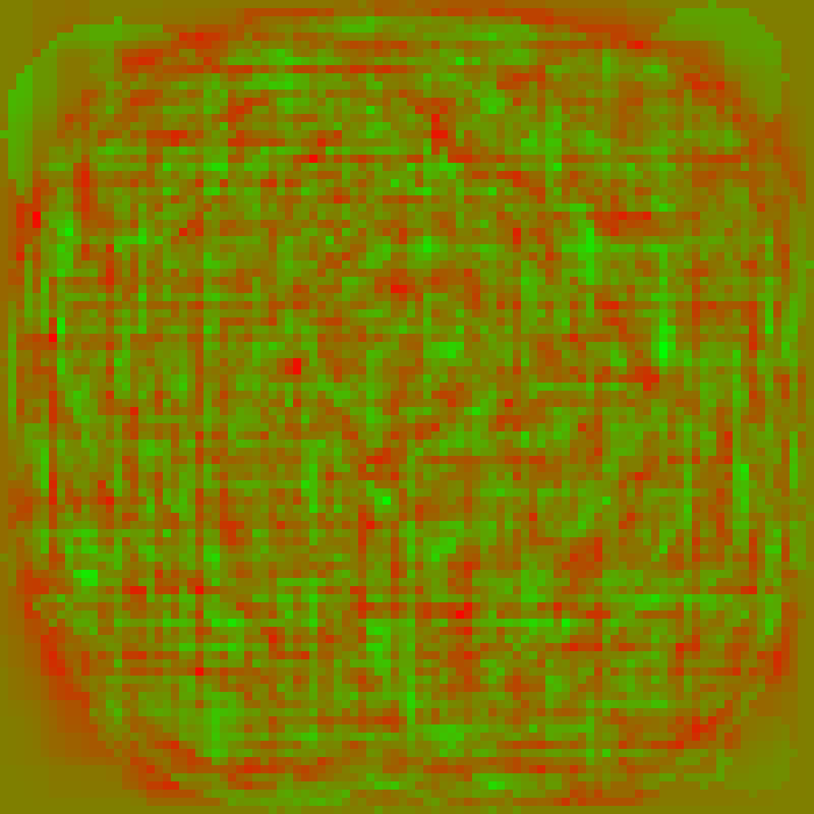

# perceptron
Simple perceptron in C

### Example of the results

#### Parameters
100x100 images, sample size - 500, bias - 6.0

#### Results
Accuracy - Untrained model (Law of Large Numbers - Proof): 500/1000 - 50.00%
Accuracy - Trained model: 694/1000 - 69.40%

#### Weights representation

# Knowledge base
- (2022) Veritasium - Analog Computing: https://www.youtube.com/watch?v=GVsUOuSjvcg
- (2024) Wikipedia - Perceptron: https://en.wikipedia.org/wiki/Perceptron

# References
- Tsoding - First Ancient Neural Network in C: https://www.youtube.com/watch?v=WEk_grxrCcg
